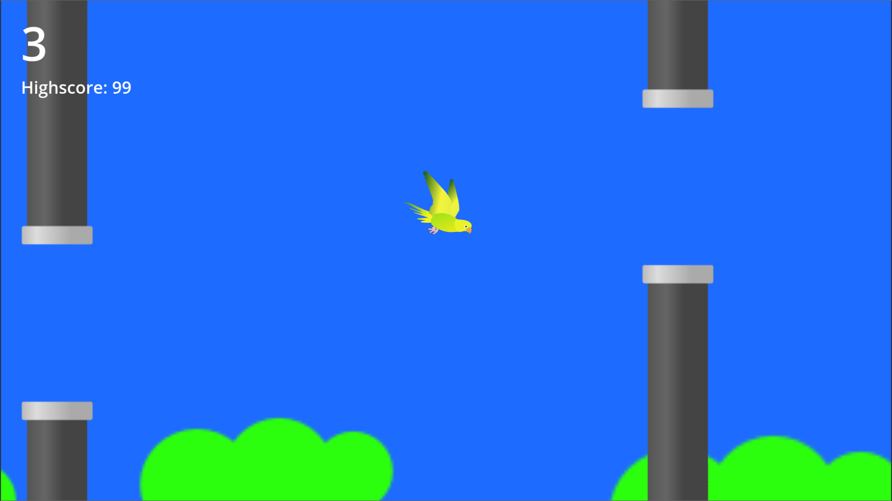

# Flappy Bappy

A flappy bird clone made with Godot.

## Installation

Head to the [Releases](https://github.com/ShadowXPA/Flappy-Bappy/releases/latest) tab and download the latest version available.  

### Windows

Run the `Flappy Bappy.exe`.  
To flap press `[SPACE]`.  

### Android

You will need to allow `Install unknown apps`.  
Install the `.apk`.  
To flap `[TAP]` any part of the screen.  

### Linux, macOS, iOS

For Linux, macOS, and iOS, you will have to build it yourself. Assuming you already have Godot, simply clone the repository, open it with Godot and build the game.  
